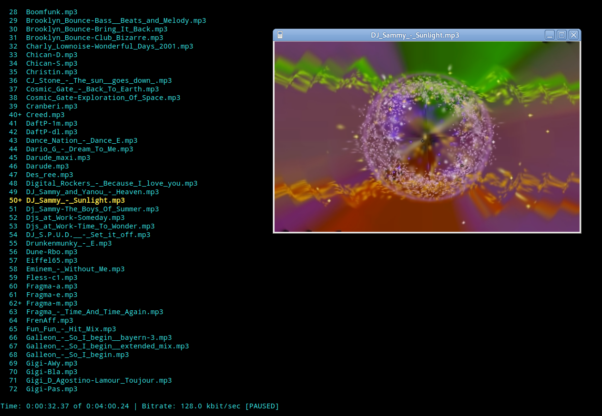
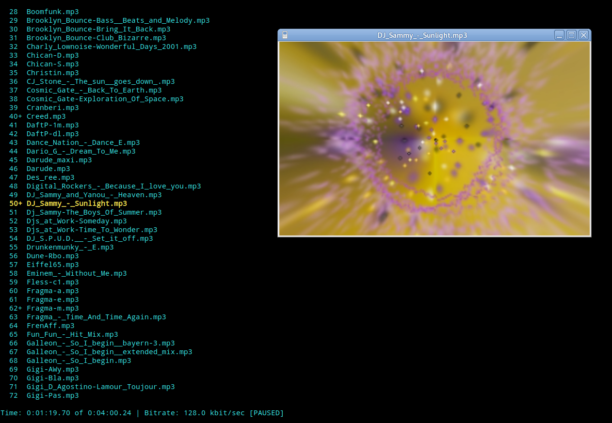

## *Musikbox* with direct title select

  

Like in old times with **Winamp**!

  

### Added features:

- permanent playlist
- colorize current title
- hide cursor
- center video
- show video size
- video_size config option

### Added options:

- set video size `-X|--video-size=<WxH>`
- hide tags `-t|--notags`

### Added hotkeys:

- play title `1-9`
- play last title `0`
- play previous title `p`
- mark favorite position `x`
- seek favorite position `y` `z`
- stop after current `t`
- single repeat `r`
- list playlist `l`
- with full path `L`
- help screen `h`

... I originally just wanted to add the backwards key.

